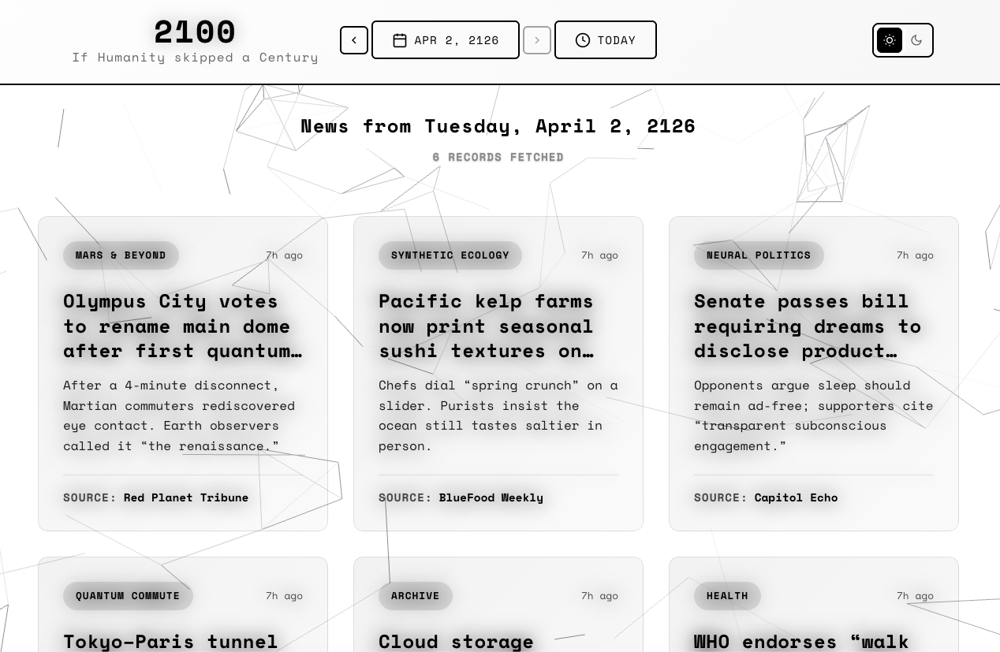
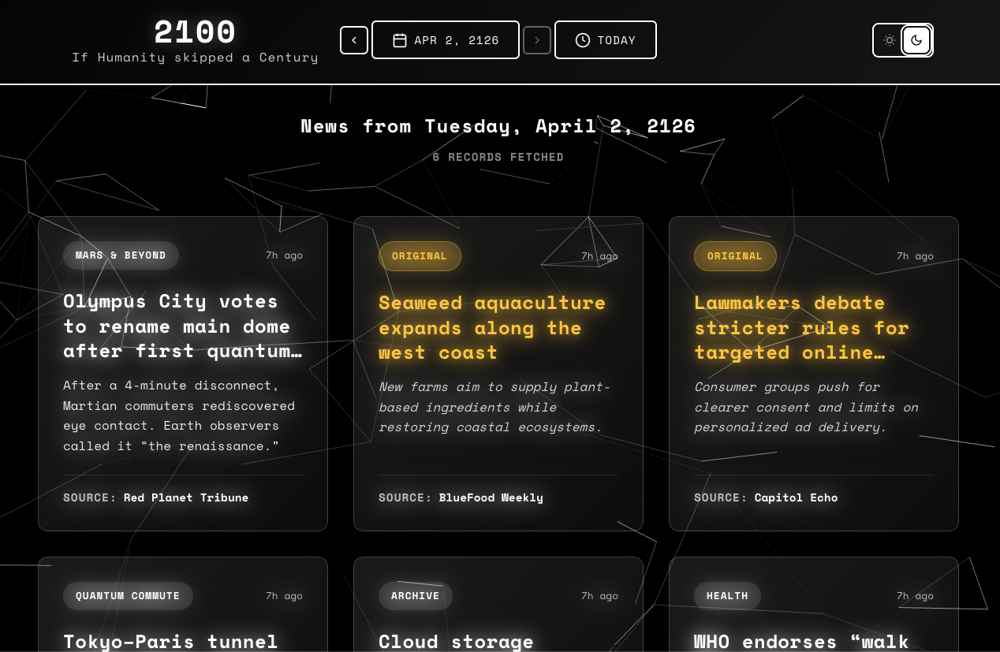

# 2100 - If Humanity skipped a Century

A modern React application that transforms current news headlines into futuristic scenarios from the year 2100. Built with Vercel, Supabase, and automated with GitHub Actions.

## Screenshots

Light theme:



Dark theme:



### Screen recording

Browser playback (after this commit is on `main`):

<video src="https://raw.githubusercontent.com/hemenduroy/2100-news/main/docs/videos/app-demo.mov" controls playsinline width="100%" style="max-width: 960px;"></video>

Direct link (download or open in a new tab if the player does not show):  
[app-demo.mov](https://raw.githubusercontent.com/hemenduroy/2100-news/main/docs/videos/app-demo.mov)

## Features

- **Modern React App**: Built with React 18, hooks, and modern JavaScript
- **Serverless Architecture**: Deployed on Vercel with API routes
- **Database Integration**: Supabase PostgreSQL for storing transformed news articles
- **Calendar Picker**: Browse news from different dates (displayed as 100 years in the future)
- **Automated Processing**: GitHub Actions updates news every hour
- **Responsive Design**: Works perfectly on desktop and mobile devices
- **Futuristic UI**: Clean black and white design with modern typography
- **GPT-4 Integration**: Uses OpenAI API to transform headlines with sci-fi humor

## Tech Stack

### Frontend
- React 18
- React Calendar
- Axios for API calls
- CSS Grid & Flexbox for responsive design
- Google Fonts (Inter & Space Mono)

### Backend
- Vercel API Routes
- Supabase PostgreSQL
- News API for RSS feeds
- OpenAI GPT-4 API
- GitHub Actions for automation

## Setup Instructions

### Prerequisites
- Node.js (v16 or higher)
- Vercel account
- Supabase account
- OpenAI API key
- News API key

### 1. Clone and Install Dependencies

```bash
npm install
```

### 2. Set Up Supabase

1. Create a new Supabase project
2. Run the SQL script in `supabase-setup.sql` in your Supabase SQL editor
3. Get your Supabase URL and anon key from Settings > API

### 3. Get API Keys

1. **OpenAI API Key**: Get from [OpenAI Platform](https://platform.openai.com/api-keys)
2. **News API Key**: Get from [NewsAPI.org](https://newsapi.org/register)

### 4. Deploy to Vercel

1. Install Vercel CLI:
   ```bash
   npm i -g vercel
   ```

2. Deploy the project:
   ```bash
   vercel
   ```

3. Set up environment variables in Vercel dashboard:
   ```
   SUPABASE_URL=your_supabase_url
   SUPABASE_ANON_KEY=your_supabase_anon_key
   OPENAI_API_KEY=your_openai_api_key
   NEWS_API_KEY=your_news_api_key
   ```

### 5. Set Up GitHub Actions

1. Push your code to GitHub
2. The GitHub Actions workflow will automatically start running
3. You can manually trigger updates from the Actions tab

## How It Works

### News Processing Pipeline
1. **GitHub Actions**: Runs every hour to trigger news updates
2. **Vercel API**: Fetches news from News API (Reuters, BBC, TechCrunch, The Verge)
3. **GPT Transformation**: Each headline is sent to GPT-4 with a fixed futuristic prompt
4. **Supabase Storage**: Transformed articles are saved to PostgreSQL with date indexing
5. **Frontend Display**: React app fetches and displays articles with futuristic styling

### Calendar System
- Users can select any past date to view news from that day
- Dates are displayed as if they're 100 years in the future (e.g., 2024 becomes 2124)
- News is stored by date, so historical browsing is possible

### Automated Updates
- GitHub Actions runs every hour to fetch fresh news
- New articles are automatically transformed and stored in Supabase
- Frontend automatically refreshes to show latest content

## API Endpoints

### Vercel API Routes
- `GET /api/news` - Get latest news
- `GET /api/news?date=YYYY-MM-DD` - Get news for specific date
- `POST /api/news` - Trigger news processing (used by GitHub Actions)

## News Sources

- **Reuters**
- **BBC News**
- **TechCrunch**
- **The Verge**

## Environment Variables

Set these in your Vercel dashboard:

```bash
SUPABASE_URL=your_supabase_project_url
SUPABASE_ANON_KEY=your_supabase_anon_key
OPENAI_API_KEY=your_openai_api_key
NEWS_API_KEY=your_news_api_key
```

## Customization

### Adding News Sources
Edit the `NEWS_SOURCES` array in `api/news.js`:

```javascript
{ id: 'source-id', name: 'Source Name', category: 'Category' }
```

### Modifying the Futuristic Prompt
Edit the `FUTURISTIC_PROMPT` constant in `api/news.js`

### Styling Changes
- Main styles: `src/index.css`
- Component styles: `src/components/*.css`
- App layout: `src/App.css`

## Development

### Running Locally
```bash
npm start
```

The app will run on `http://localhost:3000`

### Testing API Routes Locally
```bash
vercel dev
```

This will start the development server with API routes.

## Database Schema

### News Table (Supabase)
```sql
CREATE TABLE news (
  id SERIAL PRIMARY KEY,
  date VARCHAR(10) NOT NULL UNIQUE,
  articles JSONB NOT NULL DEFAULT '[]',
  created_at TIMESTAMP WITH TIME ZONE DEFAULT NOW(),
  updated_at TIMESTAMP WITH TIME ZONE DEFAULT NOW()
);
```

### Articles JSON Structure
```javascript
{
  id: String,
  originalTitle: String,
  futuristicTitle: String,
  futuristicCaption: String,
  source: String,
  category: String,
  publishedAt: String,
  link: String,
  description: String
}
```

## GitHub Actions

The workflow in `.github/workflows/update-news.yml` runs every hour to:
1. Trigger the Vercel API endpoint
2. Fetch fresh news from News API
3. Transform headlines with GPT-4
4. Store results in Supabase

## Troubleshooting

### Common Issues

1. **Vercel Deployment Errors**
   - Check environment variables are set correctly
   - Verify API keys are valid

2. **Supabase Connection Errors**
   - Verify your Supabase URL and anon key
   - Check that the news table exists

3. **OpenAI API Errors**
   - Verify your API key is correct
   - Check your OpenAI account has sufficient credits

4. **News API Errors**
   - Verify your News API key is correct
   - Check your News API account status

5. **GitHub Actions Not Running**
   - Check the Actions tab in your GitHub repository
   - Verify the workflow file is in the correct location

## Cost Considerations

- **Vercel**: Free tier includes 100GB bandwidth/month
- **Supabase**: Free tier includes 500MB database
- **OpenAI**: Pay per API call (~$0.03 per 1K tokens)
- **News API**: Free tier includes 1,000 requests/day
- **GitHub Actions**: Free tier includes 2,000 minutes/month

## License

Open source - feel free to modify and use as needed! 